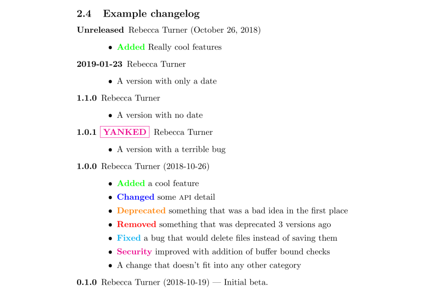

# The `changelog` LaTeX package

Changelogs are important. Unfortunately, there are few facilities
for typesetting changelogs in LaTeX. `changelog` defines a `changelog`
environment to make changelogs simple and intuitive.

Inspired by [keepachangelog.com].

File                         | Description
-----------------------------|-------------------------------
changelog.sty                | The changelog package
changelog.pdf                | Documentation (English)
changelog.tex                | Documentation source
changelog-doc.sty            | Documentation styles
README.md                    | This file
LICENSE.md                   | GNU GPLv3

## Example

    \documentclass{article}
    \usepackage[color]{changelog}
    \begin{document}

    \begin{changelog}[author=Rebecca Turner]
    \begin{version}
      \added Really cool features
    \end{version}

    \begin{version}[date=2019-01-23]
      \item A version with only a date
    \end{version}

    \begin{version}[v=1.1.0]
      \item A version with no date
    \end{version}

    \begin{version}[v=1.0.1, yanked]
      \item A version with a terrible bug
    \end{version}

    \begin{version}[v=1.0.0, date=2018-10-26]
      \added a cool feature
      \changed some \textsc{api} detail
      \deprecated something that was a bad idea in the first place
      \removed something that was deprecated 3 versions ago
      \fixed a bug that would delete files instead of saving them
      \security improved with addition of buffer bound checks
      \item A change that doesn't fit into any other category
    \end{version}
    \shortversion{v=0.1.0, date=2018-10-19,
      changes=Initial beta.}
    \end{changelog}

    \end{document}

Which renders roughly as:

[keepachangelog.com]: https://keepachangelog.com/
